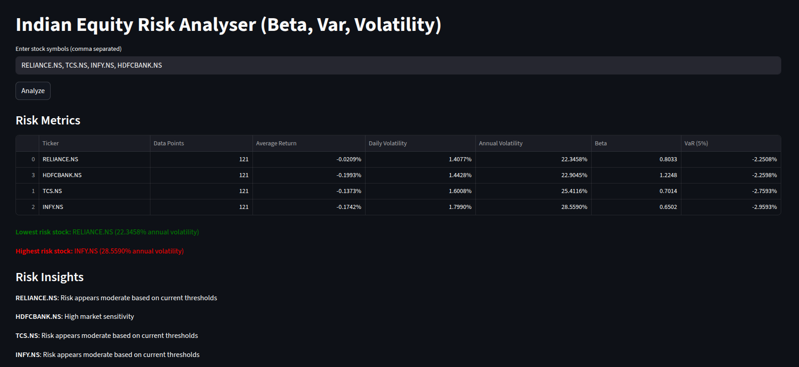
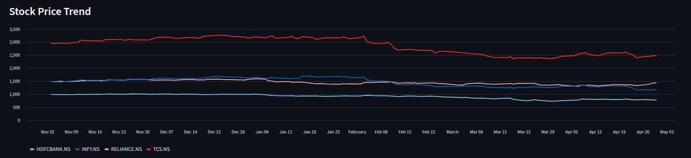

# 📊 Indian Equity Risk Analysis Tool

An analytical tool for evaluation of Indian stocks from the standpoint of risk assessment of Indian stocks as reflected by the metrics **Volatility, Beta, & Value at Risk (VaR)**.

## 🚀 Functionality

- Compare multiple stocks (RELIANCE, TCS, INFY, HDFCBANK)
- Provide Risk Metrics Analysis (Average Return, Daily/Yearly Volatility, Beta to Nifty 50, Value at Risk - 5%)
- Rank the stocks from the least to the most risky
- Provide a user-interactive dashboard via Streamlit (Web application framework)
- Provide historical price trends for the stock

## 🛠 Technical Stack

- Python
- Pandas and NumPy
- yfinance
- Streamlit

## ▶ Run Instructions

```bash
pip install -r requirements.txt
streamlit run app.py 

```


## 📸 Screenshots

### Dashboard


### Analysis View
